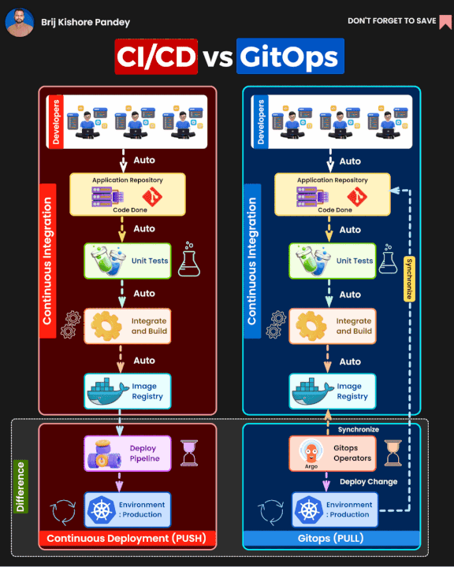

# CI/CD

CI/CD مخفف Continuous Integration (ادغام مداوم) و Continuous Delivery/Continuous Deployment (تحویل/انتشار مداوم) است و یک مجموعه از فرآیندها و بهترین شیوه‌ها است که به تیم‌های نرم‌افزاری کمک می‌کند تا کد را به‌صورت مداوم و خودکار در محیط‌های مختلف تست، ساخته، و مستقر کنند. Continuous Integration (CI) به معنای ادغام مداوم تغییرات کد از تیم‌های مختلف در یک مخزن مشترک است، به‌طوری که تغییرات به‌طور روزانه یا حتی ساعتی تست و بررسی می‌شوند. این فرآیند باعث کاهش بروز خطاهای کد و مشکلات مربوط به هماهنگی در تیم‌های بزرگ می‌شود. در کنار آن، Continuous Delivery (CD) به این معناست که پس از ساخت و تست موفقیت‌آمیز، نرم‌افزار به‌طور خودکار آماده انتشار به محیط تولید می‌شود، در حالی که Continuous Deployment (CD) به معنای انتشار خودکار تغییرات به محیط تولید است، بدون نیاز به مداخله دستی. CI/CD به‌طور کلی باعث تسریع در فرآیند توسعه، بهبود کیفیت نرم‌افزار و افزایش سرعت تحویل می‌شود.

### GitOps

GitOps یک روش مدرن برای مدیریت زیرساخت‌ها و عملیات در سیستم‌های توزیع‌شده است که بر اساس اصول Git و خودکارسازی ساخته شده است. در این روش، تمام تغییرات و تنظیمات مربوط به زیرساخت، کدهای برنامه‌نویسی و پیکربندی‌ها در مخزن‌های Git ذخیره می‌شوند و از آنجا به‌طور خودکار به محیط‌های تولید یا تست اعمال می‌شوند. این به معنای استفاده از Git به عنوان منبع حقیقت (Source of Truth) برای تمامی تغییرات در سیستم است. با استفاده از GitOps، فرآیندهای استقرار، بروزرسانی و پیکربندی به‌طور کامل خودکار می‌شوند و هر تغییری در سیستم باید ابتدا از طریق درخواست‌های تغییر (Pull Requests) در Git انجام شود. GitOps امکان نظارت دقیق‌تر، بازگشت آسان به وضعیت‌های قبلی، و کاهش خطاهای انسانی را فراهم می‌کند و با استفاده از ابزارهایی مانند ArgoCD و Flux برای هماهنگی و اجرای تغییرات به‌صورت خودکار در کلاسترهای Kubernetes یا دیگر سیستم‌های توزیع‌شده، فرآیندهای DevOps را بهبود می‌بخشد.

### تفاوت CI/CD با GitOps

CI/CD و GitOps دو رویکرد متفاوت در فرآیندهای توسعه نرم‌افزار و مدیریت زیرساخت هستند. CI/CD (ادغام مداوم و تحویل مداوم) بر روی خودکارسازی فرآیندهای ساخت، تست و استقرار نرم‌افزار تمرکز دارد، به طوری که کد جدید به‌طور مداوم به مخزن گیت ادغام شده و پس از گذراندن مراحل تست به محیط‌های تولید یا تست ارسال می‌شود. در مقابل، GitOps رویکردی برای مدیریت زیرساخت‌ها است که در آن تنظیمات زیرساخت و پیکربندی‌ها به صورت declarative در Git ذخیره می‌شوند و هر تغییر از طریق Git به طور خودکار به محیط‌های مختلف اعمال می‌شود. به عبارت دیگر، GitOps از Git به‌عنوان منبع حقیقت برای زیرساخت‌ها استفاده می‌کند و تغییرات را از طریق ابزارهایی مانند ArgoCD یا Flux به محیط‌ها اعمال می‌کند. در حالی که CI/CD بیشتر بر فرآیندهای توسعه نرم‌افزار تمرکز دارد، GitOps بیشتر برای مدیریت و استقرار زیرساخت‌ها با استفاده از Git و خودکارسازی است.

---

### راهنماهای مورد نیاز برای مهندسین CI/CD

* [Gitlab CI](/cheatsheet/gitlab-ci.md)
* [Github Action](/cheatsheet/github-action.md)
* [Gitlab](/cheatsheet/gitlab.md)
* [Github](/cheatsheet/github.md)
* [Yaml](/cheatsheet/yaml.md)
* [Marrkdown](/cheatsheet/marrkdown.md)
* [Bash](/cheatsheet/bash.md)
